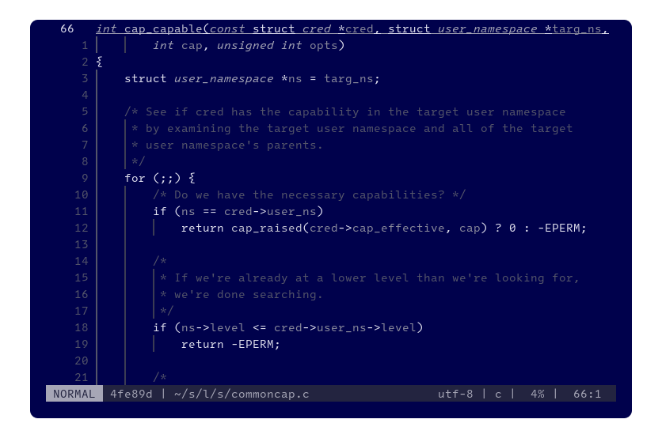

# Blue Screen #

… is a minimal and monochromatic [Neovim] theme inspired by the notorious [blue screen of death] and dedicated to [error 0xA], `IRQL_NOT_LESS_OR_EQUAL`.


Example: [Lines 66–87 from linux/security/commoncap.c@v6.0][example] rendered in [foot] at 80 × 24 featuring [Intel One Mono] at 10.5 pt, [nvim-treesitter], [Lualine][nvim-lualine/lualine.nvim] and [Indent Blankline][lukas-reineke/indent-blankline.nvim]

## Requirements ##

- Neovim 0.9.0 or later
- A terminal emulator that supports 24-bit RGB color, italics and undercurls

## Recommendations ##

This theme is optimized for the following option values:

```lua
vim.opt.colorcolumn = ""
vim.opt.cursorcolumn = false
vim.opt.cursorline = true
vim.opt.cursorlineopt = "number"
vim.opt.number = true
```

Should you prefer a different combination of option values, this theme may not work well for you.

## Installation ##

Please follow the instructions for your favorite package manager.

## Usage ##

### Lua ###

```lua
require("blue-screen").setup()
```

### Vimscript ###

```vim
colorscheme blue-screen
```

## Explicitly supported plugins ##

To promote aesthetic consistency, [Ryoko] may update highlight groups for some plugins that she uses. This theme accounts for the following plugins:

- [hrsh7th/nvim-cmp]
- [lewis6991/gitsigns.nvim]
- [nvim-lualine/lualine.nvim]
- [nvim-treesitter]

## Backward compatibility of highlight groups ##

Because the Neovim ecosystem is unstable and changing rapidly, Ryoko prefers to minimize cognitive load than to maintain backward compatibility. She will keep deprecated highlight groups for at least:

- Neovim: one minor version
- stable semantically versioned plugins: one major version
- nonversioned or unstable plugins: two months

## License ##

Blue Screen is free and open source software licensed under the [MIT license].

[blue screen of death]: https://en.wikipedia.org/wiki/Blue_screen_of_death
[error 0xA]: https://learn.microsoft.com/en-us/windows-hardware/drivers/debugger/bug-check-0xa--irql-not-less-or-equal
[example]: https://github.com/torvalds/linux/blob/v6.0/security/commoncap.c#L66-L87
[foot]: https://codeberg.org/dnkl/foot
[Intel One Mono]: https://github.com/intel/intel-one-mono
[MIT license]: ./LICENSE.txt
[Neovim]: https://github.com/neovim/neovim
[Ryoko]: https://github.com/ok-ryoko

[hrsh7th/nvim-cmp]: https://github.com/hrsh7th/nvim-cmp
[lewis6991/gitsigns.nvim]: https://github.com/lewis6991/gitsigns.nvim
[lukas-reineke/indent-blankline.nvim]: https://github.com/lukas-reineke/indent-blankline.nvim
[nvim-lualine/lualine.nvim]: https://github.com/nvim-lualine/lualine.nvim
[nvim-treesitter]: https://github.com/nvim-treesitter/nvim-treesitter
