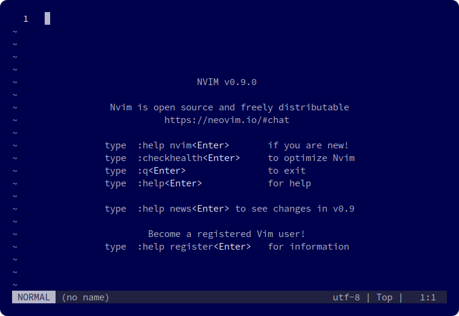
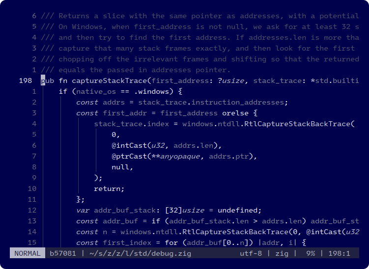

# Blue Screen

*Blue Screen* is a minimal [Neovim] theme inspired by the notorious [blue screen of death]. It is dedicated to [error 0xA], `IRQL_NOT_LESS_OR_EQUAL`.

## Gallery


> *Neovim welcome screen featuring [Source Code Pro] at 11.5 pt and [Lualine][nvim-lualine/lualine.nvim] rendered in [GNOME Terminal]*


> *[Lines 192–213 from ziglang/zig/lib/std/debug.zig@0.10.1][example] featuring [Intel One Mono] at 11.5 pt, Lualine and [Indent Blankline][lukas-reineke/indent-blankline.nvim] rendered in GNOME Terminal*

## Installation

### Requirements

Neovim 0.9.0 or later

### [Packer]

```lua
use "ok-ryoko/blue-screen"
```

## Activation

### Lua

```lua
require("blue-screen").setup()
```

### Vimscript

```vim
colorscheme blue-screen
```

## Explicitly supported plugins

- [hrsh7th/nvim-cmp]
- [lewis6991/gitsigns.nvim]
- [lukas-reineke/indent-blankline.nvim]
- [nvim-lualine/lualine.nvim]
- [nvim-treesitter]

## License

Blue Screen is free and open source software licensed under the [MIT license].

[blue screen of death]: https://en.wikipedia.org/wiki/Blue_screen_of_death
[error 0xA]: https://learn.microsoft.com/en-us/windows-hardware/drivers/debugger/bug-check-0xa--irql-not-less-or-equal
[example]: https://github.com/ziglang/zig/blob/0.10.1/lib/std/debug.zig#L192-L213
[GNOME Terminal]: https://wiki.gnome.org/Apps/Terminal
[hrsh7th/nvim-cmp]: https://github.com/hrsh7th/nvim-cmp
[Intel One Mono]: https://github.com/intel/intel-one-mono
[lewis6991/gitsigns.nvim]: https://github.com/lewis6991/gitsigns.nvim
[lukas-reineke/indent-blankline.nvim]: https://github.com/lukas-reineke/indent-blankline.nvim
[MIT license]: ./LICENSE.txt
[Neovim]: https://github.com/neovim/neovim
[nvim-lualine/lualine.nvim]: https://github.com/nvim-lualine/lualine.nvim
[nvim-treesitter]: https://github.com/nvim-treesitter/nvim-treesitter
[Packer]: https://github.com/wbthomason/packer.nvim
[Source Code Pro]: https://github.com/adobe-fonts/source-code-pro
